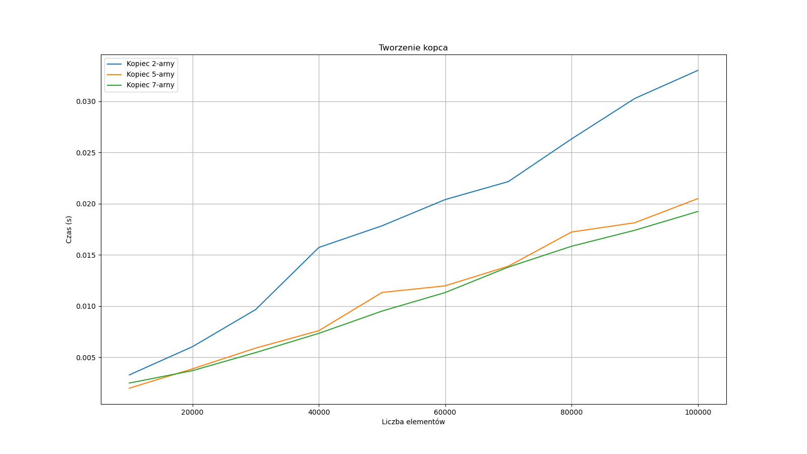
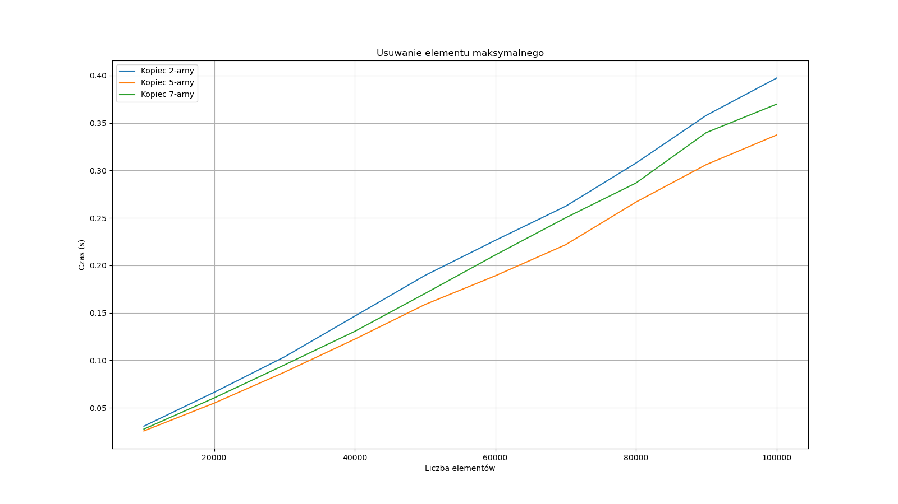

# Max-Heap Performance Analysis

## Performance Results Summary

### 1. Heap Creation 

* **Observations:** Building the Max-Heap scales efficiently and linearly $O(n)$ with the number of elements. For a dataset of 10,000 elements, the total creation time is approximately `0.010` seconds. 

### 2. Deleting Max Element

* **Observations:** The execution time required to remove the maximum element (the root) from the heap scales logarithmically/sub-linearly as the dataset grows, reaching roughly `0.012` seconds at 10,000 elements.

---

## Key Takeaways
* **Linear Initialization:** Max-Heap construction is exceptionally fast $O(n)$, making it much more efficient to build upfront compared to self-balancing search trees like AVL trees $O(n \log n)$.
* **Optimal Priority Operations:** The predictable logarithmic complexity $O(\log n)$ for extracting the maximum element makes the Max-Heap the definitive data structure choice for priority queues, Huffman coding, and scheduling algorithms.
