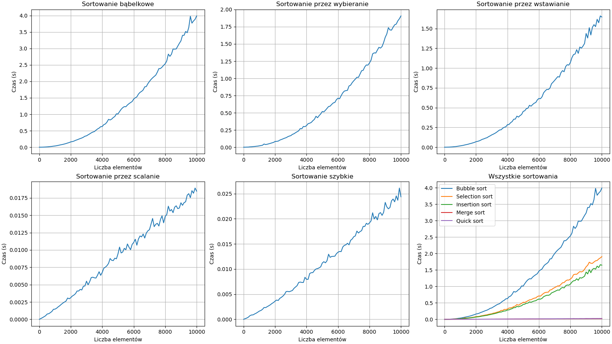

# Sorting Algorithms Complexity & Performance Analysis

## Benchmark Results

The performance graphs illustrate the clear division between $O(n^2)$ quadratic-time algorithms and $O(n \log n)$ logarithmic-time algorithms.

### 1. Quadratic Sorting Algorithms ($O(n^2)$)
These algorithms exhibit a parabolic curve, where execution time increases quadratically as the dataset grows:
* **Bubble Sort (*Sortowanie bąbelkowe*):** The slowest algorithm tested, taking approximately **4.0 seconds** for 10,000 elements.
* **Selection Sort (*Sortowanie przez wybieranie*):** Showing better performance than Bubble Sort, requiring around **1.9 seconds** for 10,000 elements due to fewer write operations.
* **Insertion Sort (*Sortowanie przez wstawianie*):** The most efficient among the quadratic algorithms, finishing in about **1.6 seconds** for 10,000 elements.

### 2. Logarithmic Sorting Algorithms ($O(n \log n)$)
These efficient divide-and-conquer algorithms show a near-linear relationship on this scale, executing orders of magnitude faster:
* **Merge Sort (*Sortowanie przez scalanie*):** Outstanding efficiency, handling 10,000 elements in less than **0.019 seconds**.
* **Quick Sort (*Sortowanie szybkie*):** Highly optimized, completing the 10,000-element task in roughly **0.025 seconds** (on average/random data).

---

### Comparison Summary (All Sorting Algorithms)

As seen in the combined chart (**Wszystkie sortowania**), the $O(n \log n)$ algorithms (Merge Sort and Quick Sort) flatten completely out near the zero baseline when plotted alongside the steep curves of Bubble, Selection, and Insertion sorts. This visually demonstrates the critical importance of selecting the right algorithm for scaling datasets.

| Algorithm | Complexity (Avg) | Time for 10k Elements (Approx.) |
| :--- | :---: | :---: |
| **Bubble Sort** | $O(n^2)$ | ~4.000 s |
| **Selection Sort** | $O(n^2)$ | ~1.900 s |
| **Insertion Sort** | $O(n^2)$ | ~1.600 s |
| **Quick Sort** | $O(n \log n)$ | ~0.025 s |
| **Merge Sort** | $O(n \log n)$ | ~0.019 s |
